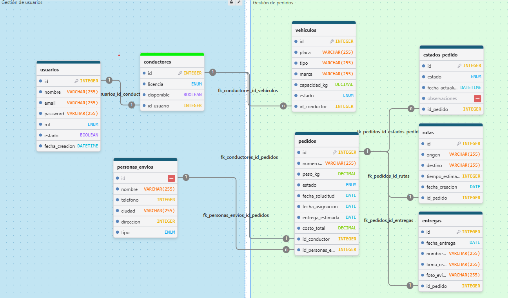

# Express Generation - Backend

Express Generation API es una aplicación backend desarrollada en Java Spring Boot para la gestión logística de envíos, incluyendo la administración de usuarios, conductores, vehículos, pedidos, rutas, entregas e historial de estados.

## 📁 Estructura del Proyecto

```bash
back-end/
├── src/
│   ├── main/
│   │   ├── java/com/express_generation/back_end/
│   │   │   ├── api/
│   │   │   │   ├── controller/      # Controladores REST (User, Driver, Vehicle, Order, Route, Delivery, OrderStatus)
│   │   │   │   ├── dtos/            # Data Transfer Objects (Request/Response/Errors)
│   │   │   │   └── error_handler/   # Manejo global de excepciones
│   │   │   ├── domain/
│   │   │   │   ├── entities/        # Entidades JPA (User, Driver, Vehicle, Order, Route, Delivery, OrderStatusHistory, ShippingPerson)
│   │   │   │   └── repositories/    # Interfaces de acceso a datos (JpaRepository)
│   │   │   ├── infrastructure/
│   │   │   │   ├── abstract_service/# Interfaces de servicio y CRUD genéricos
│   │   │   │   ├── service/         # Implementación de lógica de negocio
│   │   │   │   └── mapper/          # Mapeadores MapStruct
│   │   │   └── utils/
│   │   │       └── enums/           # Enums del sistema (Role, License, VehicleStatus, etc.)
│   │   └── resources/
│   │       └── application.properties # Configuración de servidor y base de datos
│   ├── tarea_12/
│   │   ├── diagrama_db.png          # Diagrama Entidad-Relación de la Base de Datos
│   │   └── queries_generation_express.sql # Script SQL con la creación de tablas e inserción de datos
│   ├── build.gradle                 # Configuración de Gradle y dependencias
│   ├── settings.gradle              # Configuración de proyecto raíz
│   └── README.md                    # Documentación del proyecto
```

| Servicio / Componente | Rol | Puerto Host | Base de datos | Context Path |
| --------------------- | --- | ----------- | ------------- | ------------ |
| 🐬 `mysql` | Base de datos para envíos y logística | `3306` | `generation_express` | N/A |
| ⚡ `back-end` | API REST principal de Express Generation | `8080` | MySQL | `/api/v1` |

---

## 🗄️ Base de Datos

El sistema utiliza una base de datos MySQL con la siguiente estructura y relaciones:

### Diagrama Entidad-Relación (ERD)



> [!NOTE]
> Puedes encontrar el diagrama en alta resolución en la ruta `tarea_12/diagrama_db.png` y el script de creación con datos de prueba en `tarea_12/queries_generation_express.sql`.

### Detalle de las Tablas

1. **`users`**: Registra las cuentas de usuario de la plataforma con roles de administrador (`ADMIN`) o conductor (`DRIVER`).
2. **`drivers`**: Información del conductor (licencia, disponibilidad), vinculada mediante relación 1:1 con un registro de la tabla `users`.
3. **`vehicles`**: Flota de vehículos (marca, placa, tipo, capacidad, estado) asociados a un conductor asignado (relación 1:N).
4. **`shipping_person`**: Personas involucradas en los envíos como remitentes (`SENDER`) o destinatarios (`RECIPIENT`).
5. **`orders`**: Registro de envíos/pedidos (peso, costo, número de seguimiento, fechas, conductor asignado, remitente y destinatario).
6. **`orders_status_history`**: Historial de los estados por los que pasa un pedido (`PENDING`, `ASSIGNED`, `IN_TRANSIT`, `DELIVERED`, `CANCELLED`).
7. **`routes`**: Ruta asignada a cada pedido (origen, destino, tiempo estimado). Relación 1:1 con `orders`.
8. **`deliveries`**: Comprobante de entrega efectiva del pedido (nombre del receptor, fecha y foto). Relación 1:1 con `orders`.

---

## ⚙️ Tecnologías

- **Java 22**
- **Spring Boot 4.1.0**
- **Spring Data JPA**
- **Spring Validation**
- **Spring Actuator**
- **Lombok**
- **MapStruct 1.6.3**
- **MySQL**
- **Springdoc OpenAPI (Swagger)** 3.0.3

---

## 🚀 Instalación y ejecución

### Prerrequisitos
- Tener instalado Java 22.
- Servidor MySQL activo en el puerto `3306` con la base de datos `generation_express` (o configurada según su `application.properties`).

### Clonar y preparar
```bash
git clone https://github.com/tu-usuario/back-end.git
cd back-end
```

### Ejecutar la aplicación con Gradle
En sistemas Linux / macOS:
```bash
./gradlew bootRun
```
En Windows (PowerShell / CMD):
```bash
.\gradlew.bat bootRun
```

### 📖 Documentación de la API (Swagger UI)
Una vez iniciada la aplicación, puedes acceder a la interfaz interactiva de Swagger UI para probar los endpoints en:
👉 `http://localhost:8080/api/v1/swagger-ui/index.html`

---

## 📡 Endpoints de la API

URL Base: `http://localhost:8080/api/v1`

### 👤 Módulo de Usuarios (`/user`)

| Método | Endpoint | Descripción |
|--------|----------|-------------|
| GET | `/user` | Listar usuarios (paginado: `page`, `size`, header `sortType`) |
| GET | `/user/{id}` | Obtener usuario por ID |
| POST | `/user` | Crear usuario |
| PUT | `/user/{id}` | Actualizar usuario |

### 🪪 Módulo de Conductores (`/driver`)

| Método | Endpoint | Descripción |
|--------|----------|-------------|
| GET | `/driver` | Listar conductores (paginado: `page`, `size`, header `sortType`) |
| GET | `/driver/{id}` | Obtener conductor por ID |
| POST | `/driver` | Crear conductor |
| PUT | `/driver/{id}` | Actualizar conductor |

### 🚗 Módulo de Vehículos (`/vehicle`)

| Método | Endpoint | Descripción |
|--------|----------|-------------|
| GET | `/vehicle` | Listar vehículos (paginado: `page`, `size`, header `sortType`) |
| GET | `/vehicle/{id}` | Obtener vehículo por ID |
| POST | `/vehicle` | Crear vehículo |
| PUT | `/vehicle/{id}` | Actualizar vehículo |

### 📦 Módulo de Pedidos / Envíos (`/order`)

| Método | Endpoint | Descripción |
|--------|----------|-------------|
| GET | `/order` | Listar pedidos (paginado: `page`, `size`, header `sortType`) |
| GET | `/order/{id}` | Obtener pedido por ID |
| GET | `/order/route/{routeId}` | Listar pedidos asignados a una ruta (incluye nombre de conductor) |
| POST | `/order` | Crear pedido |
| PUT | `/order/{id}` | Actualizar pedido |

### 📍 Módulo de Rutas (`/route`)

| Método | Endpoint | Descripción |
|--------|----------|-------------|
| GET | `/route` | Listar rutas (paginado: `page`, `size`, header `sortType`) |
| GET | `/route/{id}` | Obtener ruta por ID |
| GET | `/route/{routeId}/orders` | Listar pedidos asignados a la ruta (incluye nombre de conductor) |
| POST | `/route` | Crear ruta para un pedido |
| PUT | `/route/{id}` | Actualizar ruta existente |

### 📸 Módulo de Entregas (`/delivery`)

| Método | Endpoint | Descripción |
|--------|----------|-------------|
| GET | `/delivery` | Listar entregas (paginado: `page`, `size`, header `sortType`) |
| GET | `/delivery/{id}` | Obtener entrega por ID |
| POST | `/delivery` | Registrar una entrega realizada (nombre de receptor, foto, etc.) |

### 📈 Módulo de Historial de Estados (`/orderStatus`)

| Método | Endpoint | Descripción |
|--------|----------|-------------|
| GET | `/orderStatus` | Listar historial de estados (paginado: `page`, `size`, header `sortType`) |
| GET | `/orderStatus/{id}` | Obtener un registro del historial por ID |
| POST | `/orderStatus` | Agregar una actualización de estado a un pedido |
